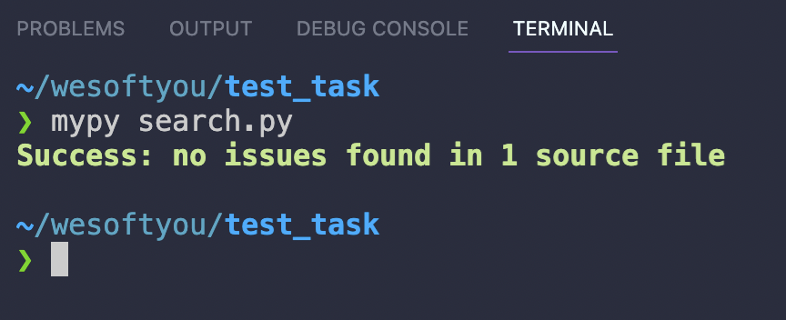
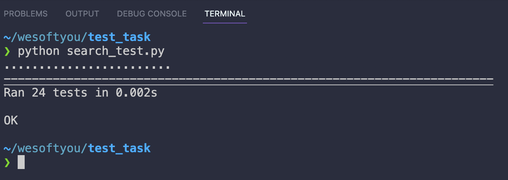

# Run the project

The source code is in `search.py` file.

## Usage

To install dependecies you should use [poetry](https://python-poetry.org/).


```sh
poetry -V
Poetry version 1.1.14

poetry install
```

Project now is available to run and can be used.

## Mypy checking

Command that runs type checking.

```sh
mypy search.py
```



## Tests

Command that runs tests.

```sh
python search_test.py
```



## Possible improvements

I decided to solve the task using just loops. The algorythm has `O(n^2)` running time.
To make it more efficient I will use trees + add performance checkups so I can be sure that performance of the code at the good level.
